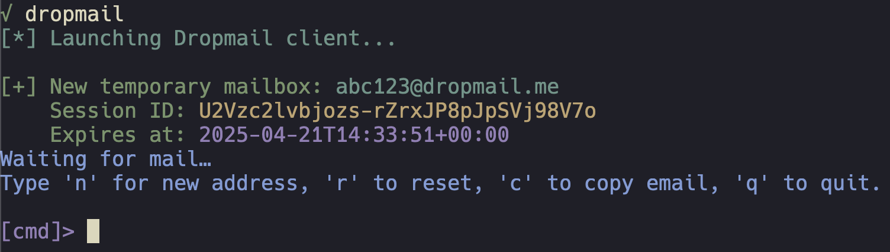

# Dropmail CLI 📧

[](https://opensource.org/licenses/MIT)
[](https://www.python.org/downloads/)

A command-line interface for temporary email addresses using [dropmail.me](https://dropmail.me) with real-time mail monitoring.



## Features ✨

- 🚀 Instant disposable email addresses
- 🔔 Real-time email polling (checks every 5 seconds)
- 📋 Copy email to clipboard (optional)
- ♻️ Generate multiple addresses per session
- 📬 View full email content in terminal
- ✔️ Session management with expiry tracking

## Installation ⚡

### Manual Installation

```bash
git clone https://github.com/danickblouin/dropmail-cli.git
cd dropmail-cli
pip install -e .  # Editable mode (links to local files)
```

### Pip Install (Not Available Yet)

```bash
pip install dropmail-cli
```

## Usage 🚀

### Start the client

```bash
dropmail
```

### Interactive Commands

While running, use these commands:
| Key | Action                          |
|-----|---------------------------------|
| `n` | Generate new email address      |
| `r` | Reset seen emails               |
| `c` | Copy current email to clipboard |
| `q` | Quit the application            |

## Requirements 📋

- Python 3.8+
- `requests` library
- `colorama` (for colored output)

Optional:
- `pyperclip` (for clipboard support)

## License 📜

MIT - See [LICENSE](LICENSE) for details.

## Legal Notice

This tool uses DropMail.me's services. By using this CLI, you agree to:

- [DropMail.me Privacy Policy](https://dropmail.me/privacypolicy.html)

This project is not affiliated with DropMail.me.
